# CAM 模块依赖分析报告

## 1. 外部依赖分析

### 核心依赖（必要）

| 依赖 | 版本 | 用途 | 必要性评估 |
|------|------|------|------------|
| `serde` | 1.0 | JSON 序列化/反序列化 | **必要** - 配置文件、API 通信 |
| `serde_json` | 1.0 | JSON 处理 | **必要** - 与 serde 配合 |
| `tokio` | 1.0 (full) | 异步运行时 | **必要** - 异步 HTTP、定时器 |
| `clap` | 4.0 (derive) | CLI 参数解析 | **必要** - CLI 工具核心 |
| `anyhow` | 1.0 | 错误处理 | **必要** - 简化错误传播 |
| `chrono` | 0.4 | 时间处理 | **必要** - 时间戳、日志 |
| `reqwest` | 0.11 | HTTP 客户端 | **必要** - API 调用 |

### 功能依赖（合理）

| 依赖 | 版本 | 用途 | 必要性评估 |
|------|------|------|------------|
| `sysinfo` | 0.31 | 系统进程信息 | **合理** - 进程扫描核心功能 |
| `dirs` | 5.0 | 系统目录路径 | **合理** - 跨平台配置目录 |
| `regex` | 1.10 | 正则表达式 | **合理** - 模式匹配 |
| `tracing` | 0.1 | 结构化日志 | **合理** - 生产级日志 |
| `tracing-subscriber` | 0.3 | 日志订阅器 | **合理** - 日志输出 |
| `fs2` | 0.4 | 文件锁 | **合理** - 并发文件访问 |

### 潜在优化

| 依赖 | 问题 | 建议 |
|------|------|------|
| `tokio` (full) | features 过多 | 可精简为 `rt-multi-thread, time, fs, io-util, sync` |
| `reqwest` (blocking) | 同时启用 async 和 blocking | 统一使用 async，移除 blocking |

---

## 2. 内部模块依赖图

```mermaid
graph TD
    subgraph "入口层"
        main[main.rs]
    end

    subgraph "核心业务层"
        agent[agent]
        agent_watcher[agent_watcher]
        mcp[mcp]
        notify[notify]
        openclaw_notifier[openclaw_notifier]
        conversation_state[conversation_state]
    end

    subgraph "Team 子系统"
        team_mod[team/mod]
        team_bridge[team/bridge]
        team_discovery[team/discovery]
        team_orchestrator[team/orchestrator]
        team_inbox_watcher[team/inbox_watcher]
    end

    subgraph "通知子系统"
        notification_mod[notification/mod]
        notification_channel[notification/channel]
        notification_dispatcher[notification/dispatcher]
        notification_builder[notification/builder]
        notification_formatter[notification/formatter]
        notification_payload[notification/payload]
        notification_urgency[notification/urgency]
        notification_event[notification/event]
        notification_dedup[notification/deduplicator]
        channels_dashboard[channels/dashboard]
        channels_openclaw[channels/openclaw_message]
    end

    subgraph "AI 层"
        anthropic[anthropic]
        ai_quality[ai_quality]
    end

    subgraph "基础设施层"
        process[process]
        session[session]
        tmux[tmux]
        watcher_daemon[watcher_daemon]
        terminal_utils[terminal_utils]
        input_detector[input_detector]
        jsonl_parser[jsonl_parser]
        task_list[task_list]
        notification_summarizer[notification_summarizer]
        throttle[throttle]
    end

    %% main 依赖
    main --> agent
    main --> agent_watcher
    main --> mcp
    main --> notify
    main --> openclaw_notifier
    main --> conversation_state
    main --> team_mod
    main --> watcher_daemon
    main --> process
    main --> session

    %% 核心业务层依赖
    agent --> tmux
    agent --> watcher_daemon

    agent_watcher --> agent
    agent_watcher --> input_detector
    agent_watcher --> jsonl_parser
    agent_watcher --> tmux

    mcp --> process
    mcp --> session
    mcp --> agent
    mcp --> jsonl_parser
    mcp --> input_detector
    mcp --> team_mod
    mcp --> task_list
    mcp --> openclaw_notifier
    mcp --> conversation_state

    notify --> process
    notify --> session
    notify --> openclaw_notifier

    openclaw_notifier --> notification_urgency
    openclaw_notifier --> notification_formatter
    openclaw_notifier --> notification_payload
    openclaw_notifier --> notification_event
    openclaw_notifier --> notification_dedup

    conversation_state --> agent
    conversation_state --> team_bridge

    %% Team 子系统依赖
    team_bridge --> team_discovery
    team_orchestrator --> agent
    team_orchestrator --> conversation_state
    team_orchestrator --> input_detector
    team_orchestrator --> team_bridge
    team_orchestrator --> team_discovery
    team_inbox_watcher --> openclaw_notifier
    team_inbox_watcher --> team_bridge

    %% 通知子系统依赖
    notification_builder --> notification_channel
    notification_builder --> notification_dispatcher
    notification_builder --> channels_dashboard
    notification_builder --> channels_openclaw
    notification_builder --> notification_urgency

    notification_dispatcher --> notification_channel

    notification_formatter --> notification_event
    notification_formatter --> anthropic
    notification_formatter --> notification_summarizer

    notification_payload --> notification_urgency
    notification_payload --> notification_summarizer

    notification_channel --> notification_urgency

    channels_dashboard --> notification_channel
    channels_dashboard --> notification_urgency
    channels_openclaw --> notification_channel
    channels_openclaw --> notification_urgency

    %% AI 层依赖
    anthropic --> ai_quality
    anthropic --> terminal_utils

    ai_quality --> anthropic

    %% 基础设施层依赖
    input_detector --> anthropic
    input_detector --> terminal_utils

    %% 样式
    classDef entry fill:#e1f5fe
    classDef core fill:#fff3e0
    classDef team fill:#e8f5e9
    classDef notification fill:#fce4ec
    classDef ai fill:#f3e5f5
    classDef infra fill:#eceff1

    class main entry
    class agent,agent_watcher,mcp,notify,openclaw_notifier,conversation_state core
    class team_mod,team_bridge,team_discovery,team_orchestrator,team_inbox_watcher team
    class notification_mod,notification_channel,notification_dispatcher,notification_builder,notification_formatter,notification_payload,notification_urgency,notification_event,notification_dedup,channels_dashboard,channels_openclaw notification
    class anthropic,ai_quality ai
    class process,session,tmux,watcher_daemon,terminal_utils,input_detector,jsonl_parser,task_list,notification_summarizer,throttle infra
```



---

## 3. 依赖问题清单

### 3.1 循环依赖

| 模块 A | 模块 B | 严重程度 | 说明 |
|--------|--------|----------|------|
| `anthropic` | `ai_quality` | **高** | 双向依赖形成循环 |

**详细分析**：
- `anthropic.rs` 导入 `ai_quality::{assess_question_extraction, assess_status_detection, thresholds}`
- `ai_quality.rs` 导入 `anthropic::{AgentStatus, NotificationContent, QuestionType}`

这是一个**类型定义与使用逻辑**的循环依赖，虽然 Rust 编译器允许（因为是同一 crate 内），但违反了单向依赖原则。

### 3.2 不合理的依赖方向

| 问题 | 模块 | 依赖 | 建议 |
|------|------|------|------|
| 高层依赖低层 | `conversation_state` | `team::TeamBridge` | Team 应该依赖 conversation_state，而非反向 |
| 跨层依赖 | `notification/formatter` | `anthropic` | 通知层不应直接依赖 AI 层 |
| 跨层依赖 | `input_detector` | `anthropic` | 检测器应该是纯逻辑，AI 调用应在上层 |

### 3.3 过度依赖（扇出过高）

| 模块 | 依赖数量 | 依赖列表 | 建议 |
|------|----------|----------|------|
| `mcp.rs` | **9** | process, session, agent, jsonl_parser, input_detector, team, task_list, openclaw_notifier, conversation_state | 拆分为多个 handler |
| `main.rs` | **10+** | 几乎所有模块 | 正常（入口点） |
| `team/orchestrator` | **6** | agent, conversation_state, input_detector, bridge, discovery, TeamMember | 考虑引入 facade |

### 3.4 重复类型定义

| 类型 | 位置 1 | 位置 2 | 问题 |
|------|--------|--------|------|
| `AgentType` | `process.rs` | `agent.rs` | 两个不同的 AgentType 枚举 |
| `SendResult` | `openclaw_notifier.rs` | `notification/channel.rs` | 同名但不同定义 |

### 3.5 未使用的依赖

通过代码分析，以下模块在 `lib.rs` 中声明但使用较少：

| 模块 | 状态 | 建议 |
|------|------|------|
| `throttle` | 仅在 lib.rs 导出 | 确认是否仍在使用 |
| `notification/terminal_cleaner` | 仅导出 `is_processing` | 考虑合并到 `input_detector` |

---

## 4. 解耦重构建议

### 4.1 解决循环依赖：anthropic ↔ ai_quality

**方案：提取共享类型到独立模块**

```
src/
├── ai_types.rs          # 新增：共享类型定义
│   ├── AgentStatus
│   ├── QuestionType
│   └── NotificationContent
├── anthropic.rs         # 依赖 ai_types
└── ai_quality.rs        # 依赖 ai_types
```

**重构步骤**：
1. 创建 `src/ai_types.rs`，移入共享类型
2. `anthropic.rs` 和 `ai_quality.rs` 都从 `ai_types` 导入
3. `ai_quality.rs` 不再依赖 `anthropic.rs`

### 4.2 解决跨层依赖：notification/formatter → anthropic

**方案：依赖注入**

```rust
// 当前（紧耦合）
pub fn format_message(event: &NotificationEvent) -> String {
    let extracted = extract_question_with_haiku(&snapshot);  // 直接调用 AI
    // ...
}

// 重构后（松耦合）
pub fn format_message(
    event: &NotificationEvent,
    extractor: &dyn QuestionExtractor,  // 注入依赖
) -> String {
    let extracted = extractor.extract(&snapshot);
    // ...
}
```

### 4.3 统一 AgentType 定义

**方案：保留一个，删除另一个**

```rust
// 保留 agent.rs 中的 AgentType（更完整）
// process.rs 中改用 agent::AgentType 或创建 ProcessAgentType
```

### 4.4 拆分 mcp.rs

**方案：按功能拆分为多个 handler**

```
src/mcp/
├── mod.rs              # MCP Server 主逻辑
├── agent_handler.rs    # Agent 相关 RPC
├── session_handler.rs  # Session 相关 RPC
├── team_handler.rs     # Team 相关 RPC
└── task_handler.rs     # Task 相关 RPC
```

### 4.5 引入分层架构

**建议的依赖方向**：

```
┌─────────────────────────────────────────┐
│              入口层 (main)               │
└─────────────────────────────────────────┘
                    ↓
┌─────────────────────────────────────────┐
│         应用层 (mcp, notify, cli)        │
└─────────────────────────────────────────┘
                    ↓
┌─────────────────────────────────────────┐
│   领域层 (agent, team, notification)     │
└─────────────────────────────────────────┘
                    ↓
┌─────────────────────────────────────────┐
│   基础设施层 (tmux, process, session)    │
└─────────────────────────────────────────┘
                    ↓
┌─────────────────────────────────────────┐
│      共享层 (types, utils, ai_types)     │
└─────────────────────────────────────────┘
```

---

## 5. 优先级建议

| 优先级 | 问题 | 影响 | 工作量 |
|--------|------|------|--------|
| **P0** | anthropic ↔ ai_quality 循环依赖 | 架构清晰度 | 小 |
| **P1** | AgentType 重复定义 | 类型混淆 | 小 |
| **P1** | SendResult 重复定义 | 类型混淆 | 小 |
| **P2** | mcp.rs 过度依赖 | 可维护性 | 中 |
| **P2** | notification/formatter 跨层依赖 | 测试困难 | 中 |
| **P3** | 引入分层架构 | 长期可维护性 | 大 |

---

## 6. 总结

### 优点
- 模块划分清晰，职责明确
- 子系统（team、notification）内聚性好
- 基础设施层独立，复用性高

### 主要问题
1. **循环依赖**：anthropic ↔ ai_quality
2. **类型重复**：AgentType、SendResult 在多处定义
3. **跨层依赖**：通知层直接调用 AI 层
4. **扇出过高**：mcp.rs 依赖过多模块

### 建议优先处理
1. 提取 `ai_types.rs` 解决循环依赖
2. 统一 `AgentType` 和 `SendResult` 定义
3. 为 `notification/formatter` 引入依赖注入
