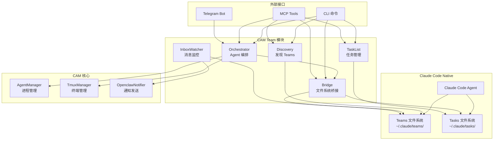
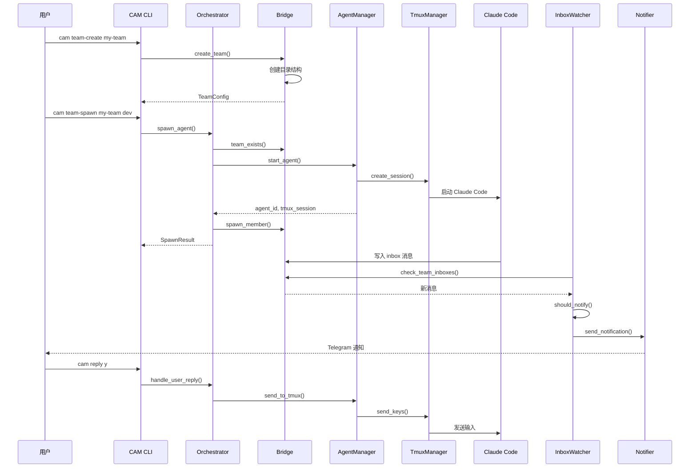

# Agent Teams 架构

CAM 的多 Agent 协作系统，扩展 Claude Code 原生 Teams 功能。

## 架构概览



## 模块详解

### 1. Discovery (discovery.rs)

Team 配置发现模块，读取 Claude Code 原生 Teams 配置。

**数据结构**:
```rust
pub struct TeamConfig {
    pub team_name: String,
    pub description: Option<String>,
    pub lead_agent_id: Option<String>,
    pub created_at: Option<u64>,
    pub members: Vec<TeamMember>,
}

pub struct TeamMember {
    pub name: String,           // 成员名称
    pub agent_id: String,       // {name}@{team} 格式
    pub agent_type: String,     // general-purpose, team-lead 等
    pub model: Option<String>,  // claude-opus-4-6 等
    pub color: Option<String>,  // UI 颜色
    pub is_active: Option<bool>,
    pub tmux_pane_id: Option<String>,
    pub cwd: Option<String>,
}
```

**核心函数**:
- `discover_teams()` - 扫描 `~/.claude/teams/` 发现所有 Teams
- `get_team_members(team_name)` - 获取指定 Team 的成员列表
- `get_active_team_members(team_name)` - 获取活跃成员

### 2. Bridge (bridge.rs)

Team 文件系统桥接模块，负责 Team 创建/删除和 Inbox 读写。

**数据存储**:
```
~/.claude/
├── teams/
│   └── {team-name}/
│       ├── config.json      # Team 配置
│       └── inboxes/
│           └── {member}.json # 成员 inbox
└── tasks/
    └── {team-name}/
        └── {task-id}.json   # 任务文件
```

**核心类型**:
```rust
pub struct InboxMessage {
    pub from: String,
    pub text: String,
    pub summary: Option<String>,
    pub timestamp: DateTime<Utc>,
    pub color: Option<String>,
    pub read: bool,
}

pub enum SpecialMessage {
    TaskAssignment { task_id: String, subject: String },
    IdleNotification { idle_reason: String },
    ShutdownApproved { request_id: String },
    PermissionRequest { tool: String, input: Value },
}

pub struct AgentId {
    pub name: String,  // 成员名称
    pub team: String,  // Team 名称
}
// 格式: {name}@{team}
```

**核心方法**:
- `create_team(name, description, project_path)` - 创建 Team
- `delete_team(name)` - 删除 Team
- `spawn_member(team, member)` - 添加成员到 Team
- `send_to_inbox(team, member, message)` - 发送消息到 inbox
- `read_inbox(team, member)` - 读取 inbox
- `mark_as_read(team, member)` - 标记消息已读
- `get_team_status(team)` - 获取 Team 完整状态

### 3. Orchestrator (orchestrator.rs)

Agent 编排模块，负责在 Team 中启动和管理 Agents。

**核心功能**:

```rust
pub struct TeamOrchestrator {
    team_bridge: TeamBridge,
    agent_manager: AgentManager,
}

pub struct SpawnResult {
    pub agent_id: String,      // CAM agent_id (cam-xxx)
    pub tmux_session: String,
    pub team: String,
    pub member_name: String,
}

pub struct TeamProgress {
    pub team_name: String,
    pub total_members: usize,
    pub active_members: usize,
    pub pending_tasks: usize,
    pub completed_tasks: usize,
    pub waiting_for_input: Vec<String>,
}
```

**核心方法**:
- `spawn_agent(team, name, agent_type, initial_prompt)` - 在 Team 中启动 Agent
- `get_team_progress(team)` - 获取 Team 聚合进度
- `shutdown_team(team)` - 优雅关闭 Team
- `create_team_for_task(task_desc, project)` - 根据任务描述创建 Team
- `assign_task(team, member, task)` - 分配任务给成员
- `handle_user_reply(reply, context)` - 处理用户回复

**用户意图解析**:
```rust
pub enum UserIntent {
    CreateTeam { task_desc: String, project: String },
    CheckProgress { team: Option<String> },
    AssignTask { member: String, task: String },
    Approve,
    Reject,
    SelectOption(usize),
    ShutdownTeam { team: String },
    Unknown(String),
}
```

### 4. InboxWatcher (inbox_watcher.rs)

Inbox 目录监控模块，检测新消息并触发通知。

**通知决策**:
```rust
pub enum Urgency {
    High,    // 权限请求、错误
    Medium,  // 任务完成、空闲
    Low,     // 普通消息
}

pub enum NotifyDecision {
    Notify { urgency: Urgency, summary: String },
    Silent,
}
```

**通知规则**:
| 消息类型 | Urgency | 行为 |
|---------|---------|------|
| PermissionRequest | HIGH | 立即通知 |
| TaskAssignment | MEDIUM | 通知 |
| IdleNotification | - | 静默 |
| ShutdownApproved | - | 静默 |
| 包含 error/错误/失败 | HIGH | 通知 |
| 包含 完成/completed/done | MEDIUM | 通知 |
| 有 summary 字段 | LOW | 通知 |
| 其他 | - | 静默 |

**核心方法**:
- `watch_team(team)` - 监控指定 Team (阻塞)
- `watch_all_teams()` - 监控所有 Teams (阻塞)
- `check_team_inboxes(team)` - 单次检查 inbox
- `should_notify(message)` - 判断是否需要通知
- `get_pending_permission_requests(team)` - 获取待处理权限请求

### 5. TaskList (task_list.rs)

任务列表管理模块，读写 Claude Code 的共享任务。

**数据结构**:
```rust
pub enum TaskStatus {
    Pending,
    InProgress,
    Completed,
    Deleted,
}

pub struct Task {
    pub id: String,
    pub subject: String,
    pub description: String,
    pub status: TaskStatus,
    pub owner: Option<String>,
    pub blocked_by: Vec<String>,
    pub blocks: Vec<String>,
    pub active_form: Option<String>,
}
```

**核心函数**:
- `list_tasks(team_name)` - 列出 Team 的所有任务
- `get_task(team_name, task_id)` - 获取指定任务
- `update_task_status(team_name, task_id, status)` - 更新任务状态
- `list_team_names()` - 列出所有 Team 名称

## Team 协作流程



## CLI 命令

### Team 管理
| 命令 | 说明 |
|------|------|
| `cam teams` | 列出所有 Teams |
| `cam team-members <team>` | 列出 Team 成员 |
| `cam team-create <name>` | 创建 Team |
| `cam team-delete <name>` | 删除 Team |
| `cam team-status <name>` | 获取 Team 状态 |

### Agent 编排
| 命令 | 说明 |
|------|------|
| `cam team-spawn <team> <name>` | 在 Team 中启动 Agent |
| `cam team-progress <team>` | 获取 Team 进度 |
| `cam team-shutdown <team>` | 关闭 Team |

### Inbox 操作
| 命令 | 说明 |
|------|------|
| `cam inbox <team>` | 读取 Team 所有 inbox |
| `cam inbox <team> -m <member>` | 读取成员 inbox |
| `cam inbox-send <team> <member> <msg>` | 发送消息 |
| `cam team-watch <team>` | 实时监控 inbox |

### 任务管理
| 命令 | 说明 |
|------|------|
| `cam tasks` | 列出所有 Team 的任务 |
| `cam tasks <team>` | 列出指定 Team 的任务 |

### 回复处理
| 命令 | 说明 |
|------|------|
| `cam pending-confirmations` | 查看待处理确认 |
| `cam reply <reply>` | 发送回复 |
| `cam reply y --target <agent_id>` | 指定目标回复 |

## MCP Tools

CAM 通过 MCP Server 暴露以下 Team 相关工具:

| Tool | 参数 | 说明 |
|------|------|------|
| `team_list` | - | 列出所有 Teams |
| `team_members` | team_name | 获取 Team 成员 |
| `team_create` | name, description?, project_path? | 创建 Team |
| `team_delete` | name | 删除 Team |
| `team_status` | name | 获取 Team 状态 |
| `inbox_read` | team, member, unread_only? | 读取 inbox |
| `inbox_send` | team, member, from?, text, summary? | 发送消息 |
| `team_pending_requests` | team? | 获取待处理请求 |
| `team_spawn_agent` | team, name, agent_type, initial_prompt? | 启动 Agent |
| `team_progress` | team | 获取 Team 进度 |
| `team_shutdown` | team | 关闭 Team |
| `team_orchestrate` | task_desc, project | 根据任务创建 Team |
| `team_assign_task` | team, member, task | 分配任务 |
| `handle_user_reply` | reply, context? | 处理用户回复 |
| `get_pending_permission_requests` | team? | 获取权限请求 |

## 与 Claude Code 原生 Teams 的集成

CAM 完全兼容 Claude Code 原生 Teams 功能:

1. **数据存储兼容**: 使用相同的 `~/.claude/teams/` 和 `~/.claude/tasks/` 目录结构
2. **配置格式兼容**: 读写相同的 `config.json` 格式
3. **Inbox 协议兼容**: 使用相同的 inbox 消息格式
4. **Agent ID 格式**: 支持 `{name}@{team}` 格式

**CAM 扩展功能**:
- 通过 tmux 管理 Agent 进程生命周期
- 通过 OpenClaw 发送通知到 Telegram
- 提供 CLI 和 MCP 接口进行远程控制
- 支持 Remote Lead Mode (远程团队领导模式)

## Agent ID 映射

CAM 维护两种 Agent ID 格式的映射:

| 格式 | 示例 | 用途 |
|------|------|------|
| CAM ID | `cam-1234567890-0` | CAM 内部进程管理 |
| Team ID | `developer@my-team` | Claude Code Teams 协议 |

映射关系存储在 `TeamMember.tmux_pane_id` 字段中。

## 已知限制

1. **并发写入**: inbox 文件写入没有文件锁，高并发可能丢失消息
2. **监控循环**: `watch_team()` 是阻塞式无限循环，无法优雅关闭
3. **ID 统一**: CAM ID 和 Team ID 的映射需要手动维护
