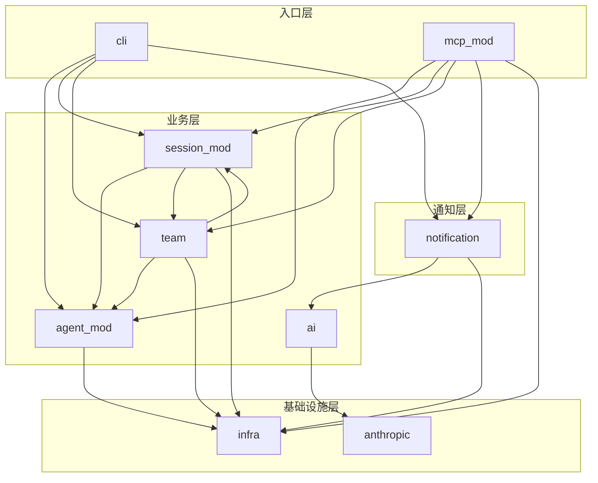

# CAM 核心模块架构

本文档描述 Code Agent Monitor (CAM) 的核心模块架构，包括模块划分、职责边界、依赖关系和关键类型。

## 模块概览

CAM 采用分层架构，从底层基础设施到上层业务逻辑分为以下层次：

```
┌─────────────────────────────────────────────────────────────┐
│                        CLI / MCP                            │
│                   (用户交互入口层)                            │
├─────────────────────────────────────────────────────────────┤
│     agent_mod    │   session_mod   │    team    │    ai     │
│   (Agent 管理)   │   (会话管理)     │  (团队编排) │  (AI 集成) │
├─────────────────────────────────────────────────────────────┤
│                      notification                           │
│                    (通知抽象层)                              │
├─────────────────────────────────────────────────────────────┤
│                        infra                                │
│              (基础设施: tmux, process, jsonl)               │
└─────────────────────────────────────────────────────────────┘
```

## 模块依赖图



## 模块详细说明

### 1. infra (基础设施层)

**路径**: `src/infra/`

**职责**: 提供底层系统交互能力，包括 tmux 操作、进程扫描、终端处理和 JSONL 解析。

**子模块**:

| 子模块 | 文件 | 职责 |
|--------|------|------|
| tmux | `tmux.rs` | tmux session 创建、销毁、输入发送、输出捕获 |
| process | `process.rs` | 系统进程扫描，识别 AI 编码代理进程 |
| terminal | `terminal.rs` | 终端输出处理和清理 |
| jsonl | `jsonl.rs` | Claude Code JSONL 日志解析 |
| input | `input.rs` | 输入等待检测，识别 agent 是否在等待用户输入 |

**关键类型**:

```rust
// tmux.rs
pub struct TmuxManager;
impl TmuxManager {
    fn create_session(&self, name: &str, cwd: &str, cmd: &str) -> Result<()>;
    fn send_keys(&self, session: &str, keys: &str) -> Result<()>;
    fn capture_pane(&self, session: &str, lines: u32) -> Result<String>;
    fn kill_session(&self, session: &str) -> Result<()>;
}

// process.rs
pub struct ProcessScanner;

// jsonl.rs
pub struct JsonlParser;
pub enum JsonlEvent { ToolUse, Error, ... }

// input.rs
pub struct InputWaitDetector;
pub struct InputWaitResult { is_waiting: bool, pattern_type: Option<InputWaitPattern>, ... }
```

---

### 2. agent_mod (Agent 生命周期管理)

**路径**: `src/agent_mod/`

**职责**: 管理 AI 编码代理的完整生命周期，包括启动、监控、状态追踪和停止。

**子模块**:

| 子模块 | 文件 | 职责 |
|--------|------|------|
| manager | `manager.rs` | Agent 启动/停止/列表，agents.json 持久化 |
| watcher | `watcher.rs` | Agent 状态监控，事件生成 |
| daemon | `daemon.rs` | 后台 watcher 守护进程管理 |
| monitor | `monitor.rs` | Agent 运行时监控 |
| event_processor | `event_processor.rs` | 事件处理和分发 |
| stability | `stability.rs` | Agent 稳定性检测 |

**关键类型**:

```rust
// manager.rs
pub struct AgentManager {
    tmux: TmuxManager,
    data_dir: PathBuf,
}

pub struct AgentRecord {
    pub agent_id: String,           // cam-{timestamp}-{counter}
    pub agent_type: AgentType,      // Claude, OpenCode, Codex, etc.
    pub project_path: String,
    pub tmux_session: String,
    pub session_id: Option<String>, // Claude Code session ID
    pub status: AgentStatus,
}

pub enum AgentType { Claude, OpenCode, Codex, GeminiCli, MistralVibe, Mock, Unknown }
pub enum AgentStatus { Running, Waiting, Stopped }

pub struct StartAgentRequest {
    pub project_path: String,
    pub agent_type: Option<String>,
    pub resume_session: Option<String>,
    pub initial_prompt: Option<String>,
    pub agent_id: Option<String>,      // 外部系统可指定
    pub tmux_session: Option<String>,  // 外部系统可指定
}

// watcher.rs
pub struct AgentWatcher;
pub enum WatchEvent { Started, Stopped, OutputChanged, ... }
pub struct AgentSnapshot { ... }

// daemon.rs
pub struct WatcherDaemon;
```

**数据存储**: `~/.config/code-agent-monitor/agents.json`

---

### 3. session_mod (会话管理)

**路径**: `src/session_mod/`

**职责**: 管理 Claude Code 会话和对话状态，支持快捷回复。

**子模块**:

| 子模块 | 文件 | 职责 |
|--------|------|------|
| manager | `manager.rs` | Claude Code 会话列表、过滤、恢复 |
| state | `state.rs` | 对话状态管理，待处理确认追踪 |

**关键类型**:

```rust
// manager.rs
pub struct SessionManager;
pub struct SessionFilter {
    pub project_path: Option<String>,
    pub days: Option<i64>,
    pub limit: Option<usize>,
}

// state.rs
pub struct ConversationStateManager {
    state_file: PathBuf,
    agent_manager: AgentManager,
    team_bridge: TeamBridge,
    tmux_manager: TmuxManager,
}

pub struct ConversationState {
    pub current_team: Option<String>,
    pub current_agent: Option<AgentContext>,
    pub pending_confirmations: Vec<PendingConfirmation>,
}

pub struct PendingConfirmation {
    pub id: String,
    pub agent_id: String,
    pub team: Option<String>,
    pub confirmation_type: ConfirmationType,
    pub context: String,
    pub tmux_session: Option<String>,
}

pub enum ConfirmationType {
    PermissionRequest { tool: String, input: Value },
    TaskApproval { task_id: String },
    ShutdownRequest { request_id: String },
    OptionSelection { options: Vec<String> },
}

pub enum ReplyResult {
    Sent { agent_id: String, reply: String },
    NeedSelection { options: Vec<PendingConfirmation> },
    NoPending,
    InvalidSelection(String),
}
```

**数据存储**: `~/.config/code-agent-monitor/conversation_state.json`

---

### 4. notification (通知抽象层)

**路径**: `src/notification/`

**职责**: 统一管理所有通知渠道，提供消息路由、去重、节流和格式化。

**子模块**:

| 子模块 | 文件 | 职责 |
|--------|------|------|
| channel | `channel.rs` | NotificationChannel trait 定义 |
| dispatcher | `dispatcher.rs` | 多渠道消息分发 |
| builder | `builder.rs` | 通知系统构建器 |
| urgency | `urgency.rs` | 紧急程度定义和路由规则 |
| channels/ | `channels/*.rs` | 具体渠道实现 (Telegram, Dashboard, WhatsApp, OpenClaw) |
| deduplicator | `deduplicator.rs` | 通知去重 |
| throttle | `throttle.rs` | 通知节流 |
| formatter | `formatter.rs` | 消息格式化 |
| summarizer | `summarizer.rs` | 通知摘要生成 |
| terminal_cleaner | `terminal_cleaner.rs` | 终端输出清理 |
| event | `event.rs` | 通知事件类型定义 |
| watcher | `watcher.rs` | 通知监控 |
| openclaw | `openclaw.rs` | OpenClaw 集成 |

**关键类型**:

```rust
// channel.rs
pub trait NotificationChannel: Send + Sync {
    fn name(&self) -> &str;
    fn should_send(&self, message: &NotificationMessage) -> bool;
    fn send(&self, message: &NotificationMessage) -> Result<SendResult>;
    fn send_async(&self, message: &NotificationMessage) -> Result<()>;
}

pub struct NotificationMessage {
    pub content: String,
    pub agent_id: Option<String>,
    pub urgency: Urgency,
    pub payload: Option<Value>,
    pub metadata: MessageMetadata,
}

pub enum SendResult { Sent, Skipped(String), Failed(String) }

// urgency.rs
pub enum Urgency { High, Medium, Low }

// dispatcher.rs
pub struct NotificationDispatcher {
    channels: Vec<Arc<dyn NotificationChannel>>,
    dry_run: bool,
}

// event.rs
pub struct NotificationEvent { ... }
pub enum NotificationEventType { ... }
```

**紧急程度路由**:

| Urgency | 事件类型 | 行为 |
|---------|----------|------|
| HIGH | permission_request, Error, WaitingForInput | 立即发送 |
| MEDIUM | AgentExited, idle_prompt | 发送 |
| LOW | session_start, stop | 静默 |

---

### 5. team (Agent Teams 编排)

**路径**: `src/team/`

**职责**: 提供 Agent Teams 的创建、管理、消息传递和任务编排功能。

**子模块**:

| 子模块 | 文件 | 职责 |
|--------|------|------|
| discovery | `discovery.rs` | Team 配置发现和成员管理 |
| bridge | `bridge.rs` | Team 文件系统操作 (创建/删除/inbox 读写) |
| orchestrator | `orchestrator.rs` | Agent 编排和任务分配 |
| inbox_watcher | `inbox_watcher.rs` | Inbox 目录监控和通知触发 |
| task_list | `task_list.rs` | 任务列表管理 |

**关键类型**:

```rust
// discovery.rs
pub struct TeamConfig {
    pub team_name: String,
    pub members: Vec<TeamMember>,
}

pub struct TeamMember {
    pub name: String,
    pub agent_id: String,        // {name}@{team}
    pub agent_type: String,
    pub model: Option<String>,
    pub is_active: Option<bool>,
    pub tmux_pane_id: Option<String>,
    pub cwd: Option<String>,
}

// bridge.rs
pub struct TeamBridge { base_dir: PathBuf }

pub struct InboxMessage {
    pub from: String,
    pub text: String,
    pub summary: Option<String>,
    pub timestamp: DateTime<Utc>,
    pub read: bool,
}

pub struct SpecialMessage { ... }
pub struct AgentId(String);

// orchestrator.rs
pub struct TeamOrchestrator {
    team_bridge: TeamBridge,
    agent_manager: AgentManager,
}

pub struct SpawnResult {
    pub agent_id: String,
    pub tmux_session: String,
    pub team: String,
    pub member_name: String,
}

pub struct TeamProgress {
    pub team_name: String,
    pub total_members: usize,
    pub active_members: usize,
    pub pending_tasks: usize,
    pub completed_tasks: usize,
    pub waiting_for_input: Vec<String>,
}

// task_list.rs
pub struct Task {
    pub id: String,
    pub subject: String,
    pub status: TaskStatus,
    pub owner: Option<String>,
    pub blocked_by: Vec<String>,
}

pub enum TaskStatus { Pending, InProgress, Completed, Deleted }
```

**数据存储**:
- Team 配置: `~/.claude/teams/{team-name}/config.json`
- Inbox 消息: `~/.claude/teams/{team-name}/inboxes/{member-name}.json`
- 任务列表: `~/.claude/tasks/{team-name}.json`

---

### 6. ai (AI 集成)

**路径**: `src/ai/`

**职责**: 提供 Anthropic API 客户端和智能内容提取功能。

**子模块**:

| 子模块 | 文件 | 职责 |
|--------|------|------|
| client | `client.rs` | Anthropic API 客户端 |
| extractor | `extractor.rs` | 终端内容智能提取 |
| types | `types.rs` | AI 相关类型定义 |
| quality | `quality.rs` | 提取质量评估 |

**关键类型**:

```rust
// client.rs
pub struct AnthropicClient {
    client: reqwest::blocking::Client,
    config: AnthropicConfig,
}

pub struct AnthropicConfig {
    pub api_key: String,
    pub base_url: String,
    pub model: String,           // 默认 claude-haiku-4-5-20251001
    pub timeout_ms: u64,         // 默认 5000ms
    pub max_tokens: u32,         // 默认 1500
}

// extractor.rs
pub fn extract_question_with_haiku(terminal: &str) -> Result<ExtractedQuestion>;
pub fn extract_notification_content(terminal: &str) -> Result<NotificationContent>;
pub fn is_agent_processing(content: &str) -> AgentStatus;

// types.rs
pub enum AgentStatus { Processing, WaitingForInput, Unknown }
pub enum QuestionType { ... }
pub struct NotificationContent { ... }
```

**API Key 优先级**:
1. `~/.config/code-agent-monitor/config.json` (anthropic_api_key)
2. 环境变量 `ANTHROPIC_API_KEY`
3. `~/.anthropic/api_key`
4. `~/.openclaw/openclaw.json`

---

### 7. mcp_mod (MCP Server)

**路径**: `src/mcp_mod/`

**职责**: 实现 Model Context Protocol，提供 JSON-RPC 接口供外部系统调用。

**子模块**:

| 子模块 | 文件 | 职责 |
|--------|------|------|
| server | `server.rs` | MCP Server 主逻辑，请求处理 |
| types | `types.rs` | MCP 协议类型定义 |
| tools/ | `tools/*.rs` | MCP 工具实现 |

**关键类型**:

```rust
// server.rs
pub struct McpServer {
    agent_manager: AgentManager,
}

// types.rs
pub struct McpRequest {
    pub jsonrpc: String,
    pub id: Option<Value>,
    pub method: String,
    pub params: Option<Value>,
}

pub struct McpResponse {
    pub jsonrpc: String,
    pub id: Option<Value>,
    pub result: Option<Value>,
    pub error: Option<McpError>,
}

pub struct McpError {
    pub code: i32,
    pub message: String,
}
```

**支持的方法**:

| 类别 | 方法 | 说明 |
|------|------|------|
| Agent | agent/start, agent/send, agent/list, agent/logs, agent/stop, agent/status | Agent 生命周期管理 |
| Team | team/list, team/members, team/create, team/delete, team/status | Team 管理 |
| Inbox | inbox/read, inbox/send | 消息传递 |
| Task | task_list, task_get, task_update | 任务管理 |
| Orchestrator | team_spawn_agent, team_progress, team_shutdown | 编排操作 |
| State | get_pending_confirmations, reply_pending | 对话状态 |

---

### 8. cli (命令行接口)

**路径**: `src/cli/`

**职责**: 提供命令行输出格式化。

**子模块**:

| 子模块 | 文件 | 职责 |
|--------|------|------|
| output | `output.rs` | CLI 输出格式化 |

---

### 9. anthropic (独立 AI 模块)

**路径**: `src/anthropic.rs`

**职责**: 提供 Haiku API 的便捷封装，用于终端状态判断和问题提取。

**关键函数**:

```rust
pub fn extract_question_with_haiku(terminal: &str) -> Result<(String, String, String)>;
```

---

## lib.rs 导出结构

```rust
// 模块声明
pub mod ai;
pub mod cli;
pub mod infra;
pub mod session;      // 实际路径 session_mod/mod.rs
pub mod mcp;          // 实际路径 mcp_mod/mod.rs
pub mod agent;        // 实际路径 agent_mod/mod.rs
pub mod team;
pub mod anthropic;
pub mod notification;

// 向后兼容的 re-exports
pub use infra::{TmuxManager, ProcessScanner, JsonlParser, ...};
pub use agent::{AgentManager, AgentRecord, AgentType, AgentStatus, ...};
pub use session::{SessionManager, ConversationStateManager, ...};
pub use mcp::McpServer;
pub use notification::{Watcher, Notifier, NotifyEvent, ...};
pub use team::{TeamConfig, TeamMember, TeamBridge, ...};
pub use anthropic::{AnthropicClient, AnthropicConfig, extract_question_with_haiku};
```

## 设计原则

### 1. 避免硬编码 AI 工具特定模式

CAM 需要兼容多种 AI 编码工具（Claude Code、Codex、OpenCode 等），使用 AI 进行智能判断而非硬编码正则。

```rust
// 正确：使用 AI 判断
pub fn is_processing(content: &str) -> bool {
    use crate::anthropic::is_agent_processing;
    matches!(is_agent_processing(content), AgentStatus::Processing)
}

// 错误：硬编码特定工具模式
static PROCESSING_PATTERNS: &[&str] = &["Hatching…", "Brewing…"];  // 不要这样做
```

### 2. 分层依赖

- 上层模块可以依赖下层模块
- 同层模块尽量避免相互依赖
- 基础设施层不依赖业务层

### 3. 数据持久化

所有状态数据存储在 `~/.config/code-agent-monitor/` 目录：

| 文件 | 用途 |
|------|------|
| agents.json | 运行中的 Agent 记录 |
| conversation_state.json | 对话状态和待处理确认 |
| dedup_state.json | 通知去重状态 |
| config.json | Haiku API 配置 |
| watcher.pid | Watcher 守护进程 PID |
| hook.log | Hook 日志 |

### 4. tmux send-keys 必须使用 -l 标志

向 tmux 发送输入时必须使用 `-l` 标志确保文本被字面解释：

```rust
// 正确
Command::new("tmux").args(["send-keys", "-t", session, "-l", input]).status()?;
Command::new("tmux").args(["send-keys", "-t", session, "Enter"]).status()?;

// 错误
Command::new("tmux").args(["send-keys", "-t", session, input]).status()?;
```
