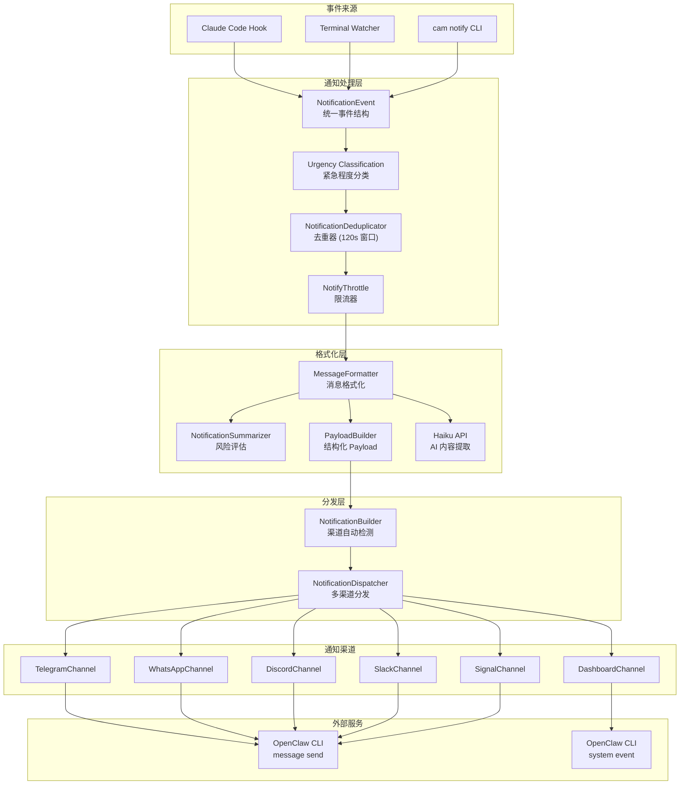
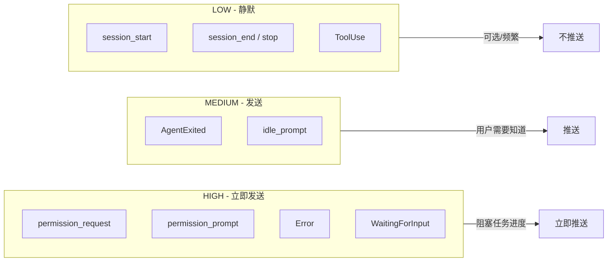
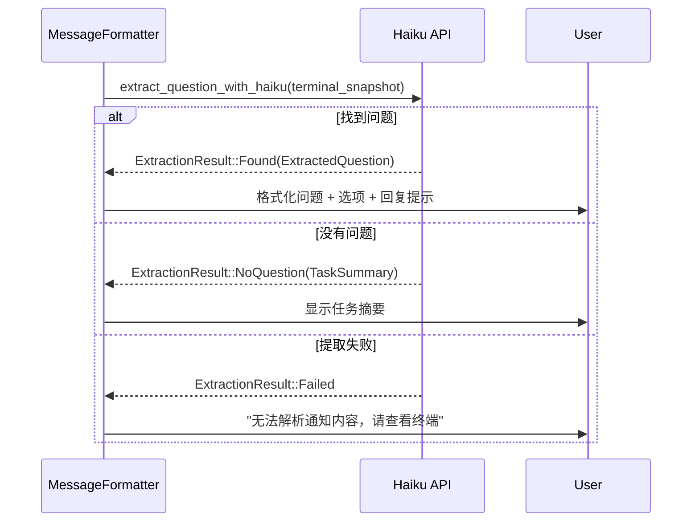
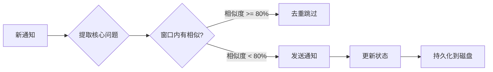
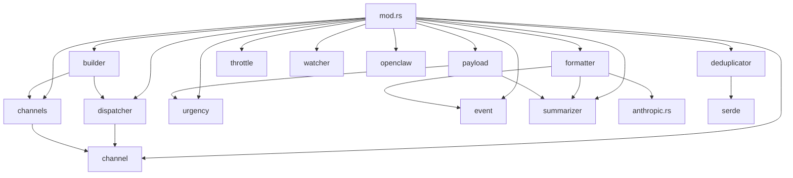

# CAM 通知系统架构

## 概述

CAM 通知系统是一个多渠道、智能化的通知分发系统，负责将 AI Agent 的状态变化和交互请求推送给用户。系统采用模块化设计，支持多种通知渠道，并通过 AI (Claude Haiku) 进行智能内容提取和格式化。

## 核心设计原则

1. **渠道解耦** - 每个渠道独立实现 `NotificationChannel` trait，互不影响
2. **智能提取** - 使用 Haiku API 从终端快照中提取问题和选项，避免硬编码模式
3. **风险评估** - 对权限请求进行自动风险分级（Low/Medium/High）
4. **去重防抖** - 120 秒窗口内相似内容自动去重，防止重复通知
5. **异步发送** - 支持同步和异步发送，不阻塞主流程

## 系统架构图



## 通知事件类型

### NotificationEventType 枚举

| 事件类型 | 描述 | 需要回复 |
|---------|------|---------|
| `WaitingForInput` | Watcher 检测到等待用户输入 | 是 |
| `PermissionRequest` | 权限请求（工具执行确认） | 是 |
| `Notification` | Hook 触发的通知 | 视类型而定 |
| `AgentExited` | Agent 进程退出 | 否 |
| `Error` | 错误发生 | 否 |
| `Stop` | 用户主动停止 | 否 |
| `SessionStart` | 会话启动 | 否 |
| `SessionEnd` | 会话结束 | 否 |

### Notification 子类型

| notification_type | 描述 | 需要回复 |
|------------------|------|---------|
| `permission_prompt` | 权限确认提示 | 是 |
| `idle_prompt` | 空闲等待输入 | 是 |
| 其他 | 一般通知 | 否 |

## Urgency 路由规则



### Urgency 分类逻辑

```rust
pub fn get_urgency(event_type: &str, context: &str) -> Urgency {
    match event_type {
        "permission_request" => Urgency::High,
        "notification" => {
            match notification_type {
                "permission_prompt" => Urgency::High,
                "idle_prompt" => Urgency::Medium,
                _ => Urgency::Low
            }
        }
        "Error" | "WaitingForInput" => Urgency::High,
        "AgentExited" => Urgency::Medium,
        "stop" | "session_end" | "session_start" | "ToolUse" => Urgency::Low,
        _ => Urgency::Low,
    }
}
```

## 多渠道分发机制

### 渠道架构

```
channels/
├── mod.rs                 # 渠道模块导出
├── telegram.rs            # Telegram 渠道（基于 OpenclawMessageChannel）
├── whatsapp.rs            # WhatsApp 渠道
├── dashboard.rs           # Dashboard 渠道（system event）
└── openclaw_message.rs    # 通用 OpenClaw message send 渠道
```

### NotificationChannel Trait

```rust
pub trait NotificationChannel: Send + Sync {
    /// 渠道名称
    fn name(&self) -> &str;

    /// 是否应该发送此消息
    fn should_send(&self, message: &NotificationMessage) -> bool;

    /// 同步发送
    fn send(&self, message: &NotificationMessage) -> Result<SendResult>;

    /// 异步发送（spawn 后立即返回）
    fn send_async(&self, message: &NotificationMessage) -> Result<()>;
}
```

### 渠道自动检测

`NotificationBuilder` 从 `~/.openclaw/openclaw.json` 自动检测已配置的渠道：

```rust
// 检测顺序
1. Telegram  - channels.telegram.allowFrom
2. WhatsApp  - channels.whatsapp.allowFrom
3. Discord   - channels.discord.defaultChannel
4. Slack     - channels.slack.defaultChannel
5. Signal    - channels.signal.allowFrom
6. Dashboard - 默认启用
```

### 渠道配置示例

```json
// ~/.openclaw/openclaw.json
{
  "channels": {
    "telegram": {
      "allowFrom": ["123456789"]
    },
    "whatsapp": {
      "allowFrom": ["+1234567890"]
    },
    "discord": {
      "defaultChannel": "channel-id"
    }
  }
}
```

## AI 内容提取 (Haiku API)

### 提取流程



### ExtractedQuestion 结构

```rust
pub struct ExtractedQuestion {
    pub question: String,           // 核心问题
    pub question_type: String,      // choice/confirm/open
    pub options: Vec<String>,       // 选项列表
    pub reply_hint: String,         // 回复提示
    pub context_complete: bool,     // 上下文是否完整
}
```

### 上下文完整性检测

当 AI 判断上下文不完整时（如问题引用了未显示的内容），系统会自动扩展上下文重试：

```
扩展策略：80 行 → 150 行 → 300 行
```

## 风险评估 (NotificationSummarizer)

### 风险等级

| 等级 | Emoji | 描述 | 示例 |
|-----|-------|------|------|
| Low | ✅ | 安全操作 | `ls`, `cat`, `/tmp/` 路径 |
| Medium | ⚠️ | 需确认 | `npm install`, `git push`, 项目文件 |
| High | 🔴 | 高风险 | `rm -rf`, `sudo`, 系统文件 |

### Bash 命令风险评估

```rust
// 高风险模式
["rm -rf", "sudo", "chmod 777", "curl|sh", "/etc/passwd", "/.ssh/"]

// 中风险模式
["npm install", "cargo build", "git push", "rm", "mv"]

// 低风险命令
["ls", "cat", "echo", "pwd", "grep", "find"]
```

### 文件路径风险评估

```rust
// 高风险路径
["/etc/", "/usr/", "/.ssh/", "/.aws/", ".env"]

// 低风险路径
["/tmp/", "node_modules/", "target/", ".cache/"]
```

## 去重和状态管理

### NotificationDeduplicator

- **去重窗口**: 120 秒
- **相似度阈值**: 80% (Jaccard 相似度，基于 3-gram)
- **持久化**: `~/.config/code-agent-monitor/dedup_state.json`



### 核心问题提取

```
原始消息:
⏸️ [myapp] 等待输入

你想要实现什么功能？

回复 y/n 或其他指引

提取后:
你想要实现什么功能？
```

### NotifyThrottle 限流器

| 功能 | 窗口 | 描述 |
|-----|------|------|
| 工具调用合并 | 3 秒 | 连续工具调用合并为一条通知 |
| 错误去重 | 5 分钟 | 相同错误不重复发送 |
| 输入等待防抖 | 10 秒 | 防止频繁的等待输入通知 |

## 消息格式化

### 格式化原则

1. **简洁** - 核心内容不超过 5 行
2. **可操作** - 明确告诉用户怎么做
3. **专业** - 现代机器人风格，无冗余信息
4. **友好 ID** - 用项目名替代 `cam-xxxxxxxxxx`

### 消息格式示例

```
权限请求:
⚠️ myapp 请求权限

请确认操作目标正确
执行: Bash
npm install express

回复 y 允许 / n 拒绝

---

等待输入:
📋 myapp 请选择

你想要实现什么功能？

1. 添加用户认证
2. 实现 API 接口
3. 编写测试用例

回复数字 (1-3)

---

任务完成:
✅ myapp 已完成

实现了用户登录功能

回复继续
```

## Payload 结构

Dashboard 渠道使用结构化 JSON payload：

```json
{
  "type": "cam_notification",
  "version": "1.0",
  "urgency": "HIGH",
  "event_type": "permission_request",
  "agent_id": "cam-xxx",
  "project": "/path/to/project",
  "timestamp": "2026-02-08T00:00:00Z",
  "event": {
    "tool_name": "Bash",
    "tool_input": {"command": "npm install"}
  },
  "summary": "请求执行 Bash 工具",
  "risk_level": "MEDIUM",
  "terminal_snapshot": "..."
}
```

## 配置文件

| 路径 | 说明 |
|------|------|
| `~/.config/code-agent-monitor/config.json` | Haiku API 配置 |
| `~/.config/code-agent-monitor/dedup_state.json` | 去重状态持久化 |
| `~/.openclaw/openclaw.json` | 渠道配置（自动检测） |

### Haiku API 配置

```json
{
  "anthropic_api_key": "sk-xxx",
  "anthropic_base_url": "http://localhost:23000/"
}
```

## 模块依赖关系



## 扩展指南

### 添加新渠道

1. 在 `channels/` 下创建新文件
2. 实现 `NotificationChannel` trait
3. 在 `NotificationBuilder::build()` 中添加检测逻辑
4. 更新 `channels/mod.rs` 导出

### 添加新事件类型

1. 在 `event.rs` 的 `NotificationEventType` 枚举中添加新变体
2. 在 `urgency.rs` 的 `get_urgency()` 中添加分类规则
3. 在 `formatter.rs` 中添加格式化逻辑
4. 在 `payload.rs` 中添加 payload 构建逻辑
