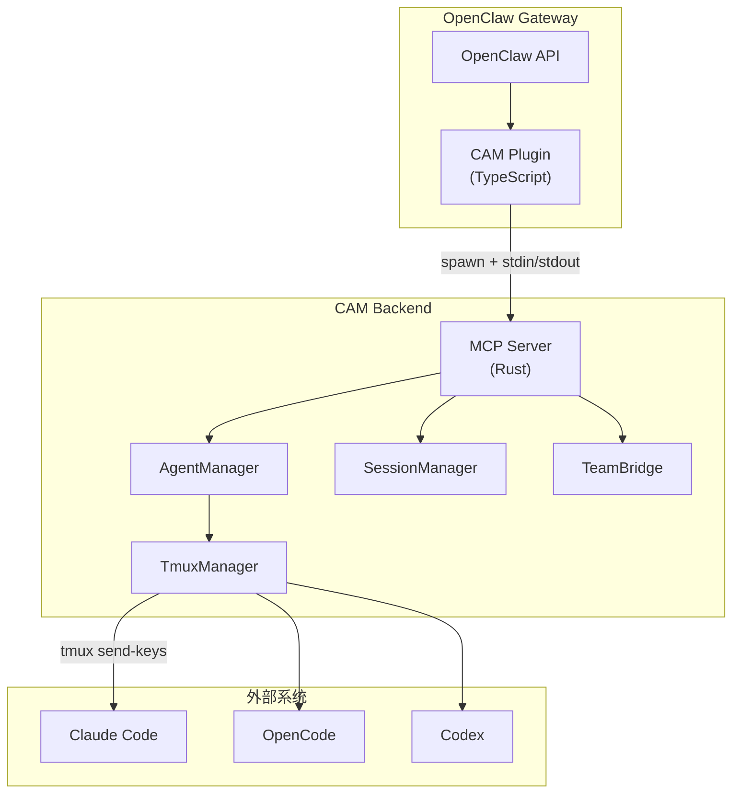
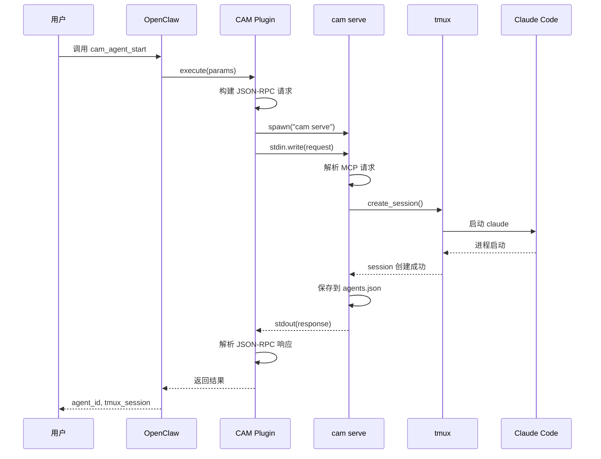

# CAM Plugin 集成架构

本文档描述 CAM (Code Agent Monitor) 与 OpenClaw 的 Plugin 集成架构。

## 概述

CAM Plugin 是一个 TypeScript 模块，作为 OpenClaw 的扩展运行，通过 MCP (Model Context Protocol) JSON-RPC 协议与 Rust 后端通信。

## 架构图



## 调用流程



## 核心组件

### 1. Plugin 入口 (src/index.ts)

Plugin 通过 OpenClaw 的 `api.registerTool()` 注册工具：

```typescript
export default function (api) {
  api.registerTool({
    name: "cam_agent_start",
    description: "启动新的 Claude Code agent",
    parameters: Type.Object({
      project_path: Type.String({ description: "项目目录路径" }),
      agent_type: Type.Optional(Type.String()),
      prompt: Type.Optional(Type.String()),
      // ...
    }),
    async execute(_id, params) {
      const result = await callCamMcp("agent_start", params, 45000);
      return { content: [{ type: "text", text: JSON.stringify(result) }] };
    },
  });
}
```

### 2. MCP 调用函数 (callCamMcp)

核心通信函数，通过 spawn 子进程调用 `cam serve`：

```typescript
async function callCamMcp(toolName: string, args: object, timeoutMs: number = 10000): Promise<object> {
  return new Promise((resolve, reject) => {
    // 构建 JSON-RPC 2.0 请求
    const request = JSON.stringify({
      jsonrpc: "2.0",
      id: 1,
      method: "tools/call",
      params: { name: toolName, arguments: args }
    });

    // 启动 cam serve 进程
    const proc = spawn(CAM_BIN, ["serve"], { timeout: timeoutMs });

    // 通过 stdin 发送请求
    proc.stdin.write(request);
    proc.stdin.end();

    // 从 stdout 读取响应
    proc.stdout.on("data", (data) => stdout += data);

    proc.on("close", (code) => {
      const response = JSON.parse(stdout);
      if (response.error) {
        reject(new Error(response.error.message));
      } else {
        resolve(response.result);
      }
    });
  });
}
```

### 3. MCP Server (Rust)

Rust 端的 MCP Server 运行在 stdio 模式：

```rust
pub async fn run(&self) -> Result<()> {
    let stdin = tokio::io::stdin();
    let mut stdout = tokio::io::stdout();
    let mut reader = BufReader::new(stdin);

    loop {
        // 从 stdin 读取 JSON-RPC 请求
        reader.read_line(&mut line).await?;
        let request: McpRequest = serde_json::from_str(&line)?;

        // 处理请求
        let response = self.handle_request(request).await;

        // 写入响应到 stdout
        stdout.write_all(serde_json::to_string(&response)?.as_bytes()).await?;
    }
}
```

## MCP 协议

### 请求格式

```json
{
  "jsonrpc": "2.0",
  "id": 1,
  "method": "tools/call",
  "params": {
    "name": "agent_start",
    "arguments": {
      "project_path": "/path/to/project",
      "agent_type": "claude"
    }
  }
}
```

### 响应格式

成功响应：
```json
{
  "jsonrpc": "2.0",
  "id": 1,
  "result": {
    "content": [{
      "type": "text",
      "text": "{\"agent_id\": \"cam-123\", \"tmux_session\": \"cam-123\"}"
    }]
  }
}
```

错误响应：
```json
{
  "jsonrpc": "2.0",
  "id": 1,
  "error": {
    "code": -32603,
    "message": "Agent not found: cam-123"
  }
}
```

## 暴露的工具列表

### Agent 生命周期管理

| 工具名 | 描述 | 关键参数 |
|--------|------|----------|
| `cam_agent_start` | 启动新的 Agent | `project_path` (必填), `agent_type`, `prompt` |
| `cam_agent_stop` | 停止运行中的 Agent | `agent_id` |
| `cam_agent_list` | 列出所有 CAM 管理的 Agent | 无 |

### Agent 交互

| 工具名 | 描述 | 关键参数 |
|--------|------|----------|
| `cam_agent_send` | 向 Agent 发送消息 | `agent_id`, `message` |
| `cam_agent_status` | 获取 Agent 结构化状态 | `agent_id` |
| `cam_agent_logs` | 获取 Agent 终端输出 | `agent_id`, `lines` |

### 会话管理

| 工具名 | 描述 | 关键参数 |
|--------|------|----------|
| `cam_list_sessions` | 列出历史会话 | `project_path`, `days`, `limit` |
| `cam_resume_session` | 恢复历史会话 | `session_id` |

### 进程管理（低级）

| 工具名 | 描述 | 关键参数 |
|--------|------|----------|
| `cam_list_agents` | 列出所有 Claude Code 进程 | 无 |
| `cam_kill_agent` | 终止进程 | `pid` |
| `cam_send_input` | 向 tmux 发送原始输入 | `tmux_session`, `input` |

## Plugin 配置

### clawdbot.plugin.json

```json
{
  "id": "cam",
  "name": "Code Agent Monitor",
  "description": "Monitor and manage AI coding agents via CAM MCP server.",
  "configSchema": {
    "type": "object",
    "additionalProperties": false,
    "properties": {}
  }
}
```

### package.json

```json
{
  "name": "cam",
  "version": "1.0.0",
  "type": "module",
  "openclaw": {
    "extensions": ["./src/index.ts"]
  },
  "dependencies": {
    "@sinclair/typebox": "0.34.47"
  }
}
```

## 数据流

```
Plugin → callCamMcp() → spawn("cam serve") → stdin → MCP Server
                                                         ↓
                                                   handle_request()
                                                         ↓
                                                   AgentManager
                                                         ↓
                                                   TmuxManager
                                                         ↓
                                                   Claude Code
```

## 超时配置

不同操作有不同的超时时间：

| 操作 | 超时时间 | 原因 |
|------|----------|------|
| 默认 | 10s | 一般操作 |
| `agent_start` | 45s | 需要等待 Claude Code 就绪 |
| `resume_session` | 45s | 需要等待会话恢复 |

## 错误处理

Plugin 层统一捕获错误并返回结构化响应：

```typescript
async execute(_id, params) {
  try {
    const result = await callCamMcp("agent_start", params, 45000);
    return { content: [{ type: "text", text: JSON.stringify(result) }] };
  } catch (error) {
    api.logger.error("cam_agent_start failed", { error, params });
    return { content: [{ type: "text", text: JSON.stringify({
      error: true,
      message: error.message
    }) }] };
  }
}
```

## 构建和部署

```bash
# 构建 Rust 后端
cargo build --release

# 复制二进制到 Plugin 目录
cp target/release/cam plugins/cam/bin/cam

# 重启 OpenClaw Gateway
openclaw gateway restart
```

## 相关文件

- Plugin 入口: `plugins/cam/src/index.ts`
- Plugin 配置: `plugins/cam/clawdbot.plugin.json`
- MCP Server: `src/mcp_mod/server.rs`
- MCP 类型: `src/mcp_mod/types.rs`
- Agent 管理: `src/agent_mod/manager.rs`
- CLI 入口: `src/main.rs`
